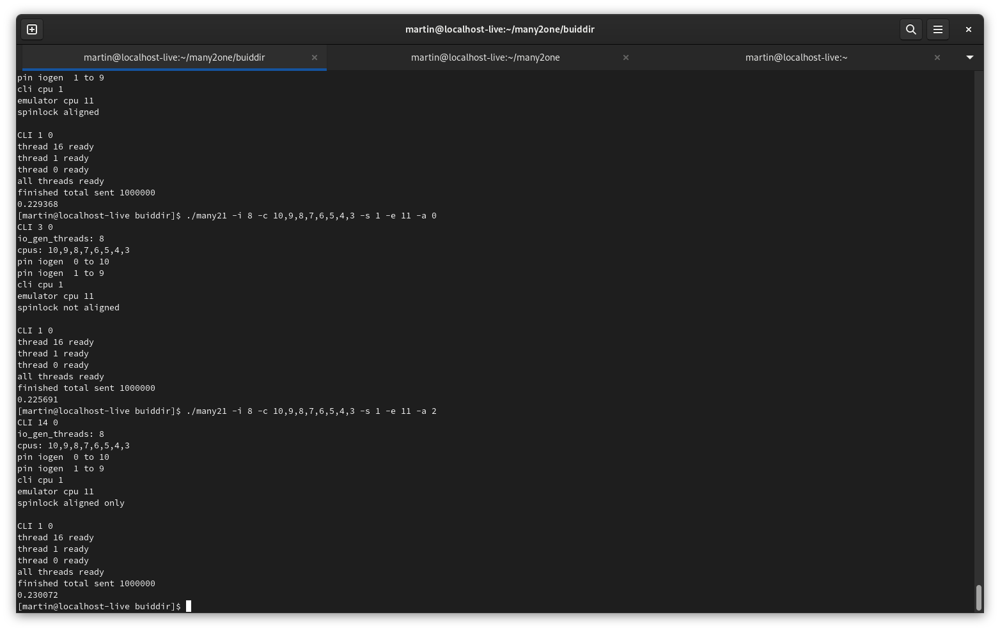
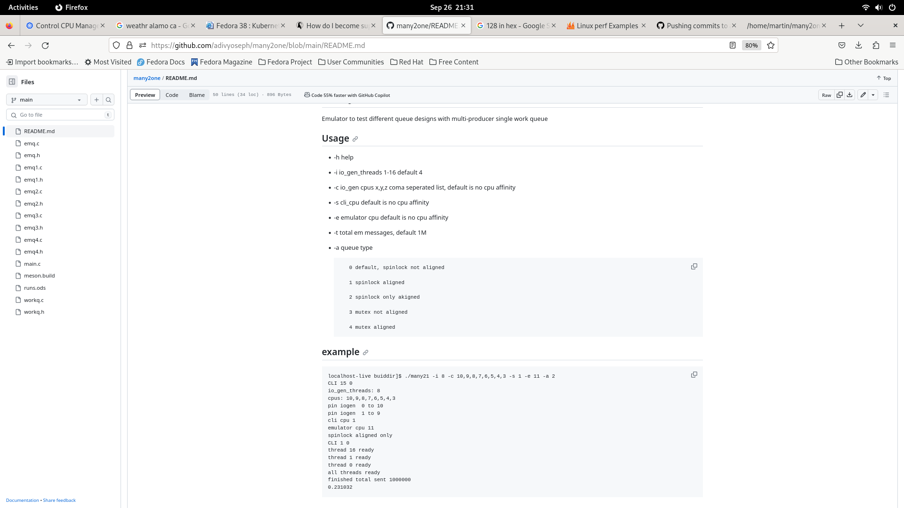

# many2one
Emulator to test different queue designs with multi-producer single work queue

## Usage 

- -h     help

- -i    io_gen_threads 1-16 default 4

- -c     io_gen cpus x,y,z       coma seperated list, default is no cpu affinity

- -s     cli_cpu     default is no cpu affinity

- -e   emulator cpu    default is no cpu affinity

- -t   total em messages, default 1M

- -a queue type

         0 default, spinlock not aligned

         1 spinlock aligned

         2 spinlock only akigned

         3 mutex not aligned

         4 mutex aligned


## example 

```
localhost-live buiddir]$ ./many21 -i 8 -c 10,9,8,7,6,5,4,3 -s 1 -e 11 -a 2
CLI 15 0
io_gen_threads: 8
cpus: 10,9,8,7,6,5,4,3 
pin iogen  0 to 10
pin iogen  1 to 9
cli cpu 1
emulator cpu 11
spinlock aligned only
CLI 1 0
thread 16 ready
thread 1 ready
thread 0 ready
all threads ready
finished total sent 1000000
0.231032
```

## Screen shot





